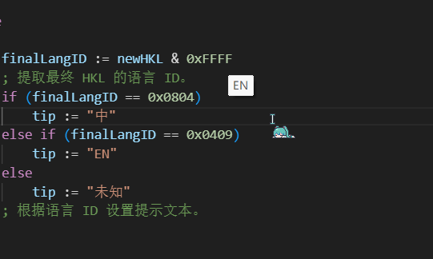

## 🎉 CapsLock Input Method Switcher (Multi-Version)
## 一个大写键改成输入法切换的工具（保留大写功能）

**AutoHotkey v2 输入法切换增强脚本 - 作者：LengxiQwQ**

欢迎来到这个 **超级实用、可自由选择版本** 的输入法切换脚本合集！
 脚本基于 **AutoHotkey v2** 编写，专注于让你更丝滑地切换输入法，尤其适合我们这种需要**频繁切换中英文**的程序猿宝宝们😋

灵感来源于苹果的**妙控键盘**，大写键就是中英文切换，我觉得非常好用

 #### 😎 脚本仅占用仅1MB内存！非常轻便

 

不同版本侧重点不同：有的最稳，有的最全，有的极简，有的更适合调试

------

## ⭐ 具体功能

- 将不常用的 **CapsLock** 改成 **输入法切换键**，点击即可切换输入法
 
- 长按 0.2s 正常**切换大写**，再次长按或短按切回
 
- 目前只支持 **中文输入法** 与**英文输入法**
 
- 兼容 WhatsApp、Chrome、VSCode 等多种软件
 
- 多版本选择，让你挑到最适合自己的脚本

------

## 📥 下载方式（源代码 + EXE）

本项目同时提供两种下载方式，让你按需选择：

### 🚀 **1. 免安装 EXE 版本（.exe）**

- 不需要安装 AutoHotkey

- 双击即可运行，放哪都能用

- 适合普通用户、办公电脑

- Release 页面中可直接下载

 #### 💡 EXE 与 AHK 源码功能完全一致，只是方便使用的打包版本

### 🧩 **2. 源代码版本（.ahk）**

- 适合会修改脚本、喜欢自定义的人

- 需要已安装 AutoHotkey v2。如果还没有？[官方下载](https://autohotkey.com/)

- 可自由编辑代码、学习、扩展功能

- 各版本的 `.ahk` 脚本都在仓库中可直接查看

------

## 📦 所有版本一览

| 版本                                              | 特点概述                                   | 输入法【中英】名称显示             | 多输入法支持 | WhatsApp 等非标准 Win32 窗口 | 适合人群             |
| ------------------------------------------------- | ------------------------------------------ | ---------------------------------- | ------------ | ---------------------------- | -------------------- |
| ⭐ **Recommend_CapsLock_Input_Method_Switcher**                      | 最稳定的推荐版本，应用兼容正常（光标显示） | ⚠ 多个中文输入法有些会显示【未知】 | ✔ 支持       | ✔ 完全兼容                   | 日常使用、偏稳定     |
| 🌈 **Multi_IME-CapsLock_Input_Method_Switcher**                    | 功能最全，输入法中英文识别最完整           | ✔ 完整准确                         | ✔ 完整支持   | ⚠ 可能显示错误               | 多输入法同时使用     |
| 🔕 **Non_Cursor_CapsLock_Input_Method_Switcher**                            | 极简版，没有光标提示                       | ❌ 不显示                           | ✔ 支持       | ✔ 最稳定                     | 需要纯切换、极简主义 |
| ⌨️ Win+Space_only_CapsLock_Input_Method_Switcher** | 使用 Windows 原生切换方式，兼容性最强      | ❌ 显示不稳定                       | ✔ 系统级支持 | ✔ 最佳兼容                   | 想保持原生行为的用户 |

> 💡 所有对应的 `.exe` 都是与 `.ahk` 版本一一对应打包而成

------

## 📝 安装方法

源代码版依赖 `AutoHotkey v2` `.exe` 版免安装，双击运行即可

脚本程序需要**管理员权限**，不然无法在 **有管理员权限** 的窗口中切换输入法

### 设置开机启动，不然每次开机都要手动开启，方法如下：

按 `Win + R` 输入 `shell:startup` 打开启动文件夹，把 `脚本`或`.exe`文件直接放进去即可

或者直接打开这个路径：`C:\Users\[输入你的用户名]\AppData\Roaming\Microsoft\Windows\Start Menu\Programs\Startup`

------

## 💬 使用须知 & 小提示

- 本脚本依赖 **AutoHotkey v2**（仅源代码版需要）
 
- 多输入法显示依赖 Windows 的 HKL 机制，不同软件查询能力不同
 
- WhatsApp 等非标准 Win32 窗口限制多，因此不同版本显示效果可能不同（表格已注明）

------

## ❤️ 感谢使用！ 
